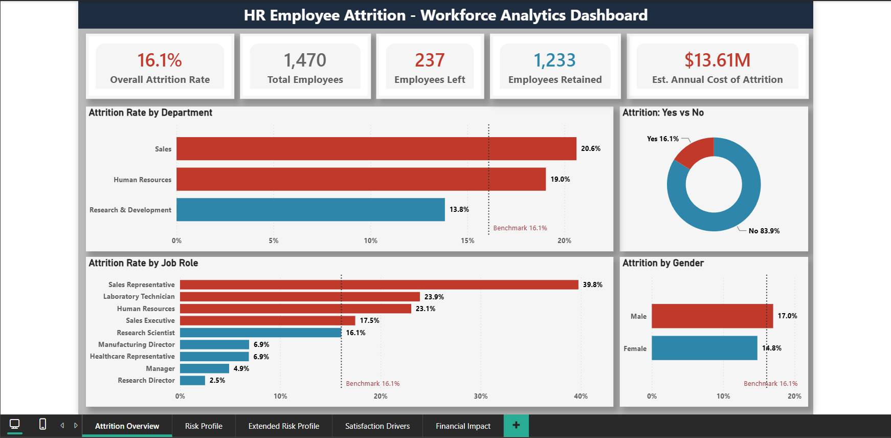
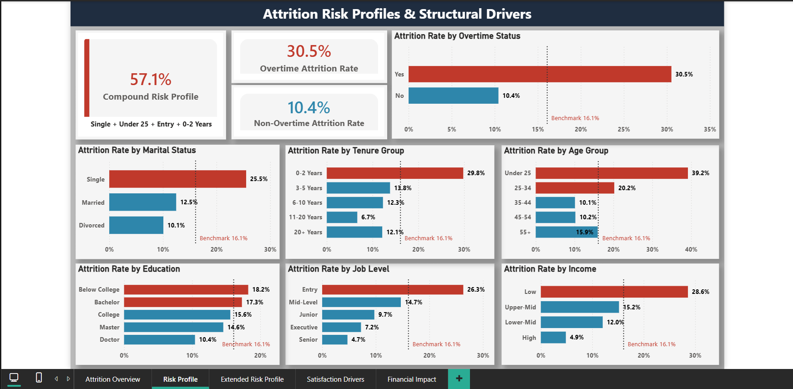
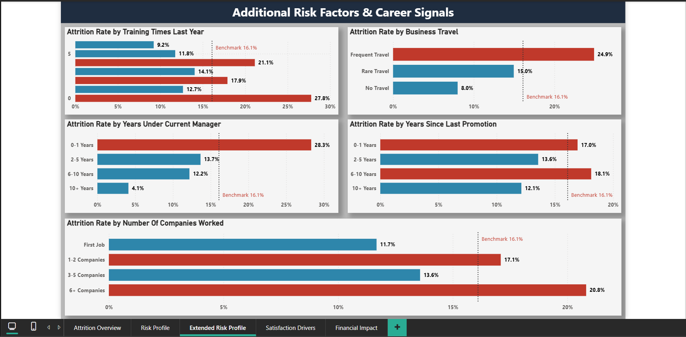
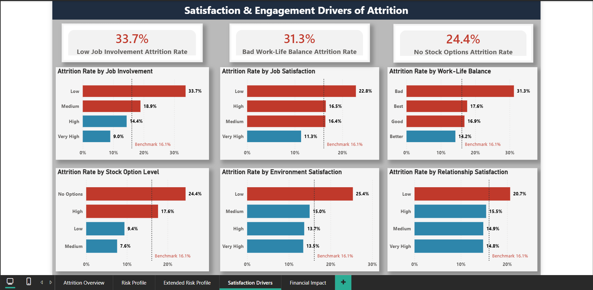
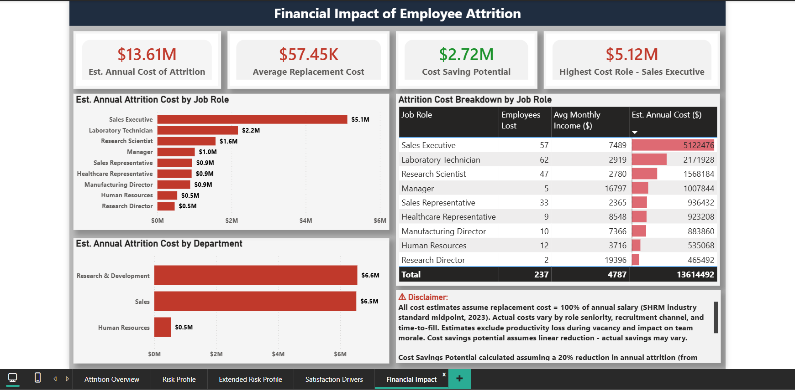

# 👥 HR Employee Attrition & Workforce Analytics


---



---

## 📊 Quick Stats

| | |
|---|---|
| **Dataset** | IBM HR Analytics — 1,470 employees, 35 columns |
| **Tools** | Excel · PostgreSQL 18 · Power BI · DAX · Power Query |
| **Analysis** | 5 pivot tables · 20 SQL queries · 5 dashboard pages · 17 DAX measures |
| **Headline Finding** | $13.61M annual attrition cost · 57.1% compound risk profile |
| **Key Technique** | Cross-tool validation — all Excel findings verified in SQL |

---

## 📋 Table of Contents

- [Project Overview](#-project-overview)
- [Tools & Technologies](#-tools--technologies)
- [Business Context & Problem Statement](#-business-context--problem-statement)
- [Key Findings](#-key-findings)
- [Dashboard Walkthrough](#-dashboard-walkthrough)
- [Data Cleaning Process](#-data-cleaning-process)
- [SQL Analysis](#-sql-analysis)
- [DAX Measures](#-dax-measures)
- [Assumptions & Limitations](#-assumptions--limitations)
- [Strategic Recommendations](#-strategic-recommendations)
- [How to Reproduce](#-how-to-reproduce)
- [Repository Structure](#-repository-structure)
- [Methodology Notes](#-methodology-notes)
- [Key Learnings](#-key-learnings)
- [Contact](#-contact)

---

## 🔍 Project Overview

This project delivers an end-to-end HR attrition analysis for a mid-size technology company experiencing significant employee turnover. Acting as a Data Analyst engaged by the Chief People Officer, the analysis moves from raw data through structured cleaning, multi-tool analysis, and a five-page interactive Power BI dashboard — culminating in a $13.61M annual cost quantification and actionable retention recommendations.

The analysis demonstrates cross-tool validation methodology: every finding produced in Excel pivot tables was independently verified in PostgreSQL SQL queries, ensuring analytical integrity across the full project.

**Dataset:** [IBM HR Analytics Employee Attrition & Performance](https://www.kaggle.com/datasets/pavansubhasht/ibm-hr-analytics-attrition-dataset) — Kaggle · 1,470 rows · 35 columns

---

## 🔧 Tools & Technologies

| Tool | Version | Purpose |
|---|---|---|
| Microsoft Excel | Office 2021 | Data cleaning, pivot table analysis, CHOOSE/IF formulas |
| PostgreSQL | 18 | Relational database, SQL analysis, compound risk profiling |
| Power BI Desktop | Latest | Interactive dashboard, DAX measures, Power Query transformations |
| DAX | — | 17 custom measures + 1 calculated column across 4 display folders |
| Power Query | — | Custom grouping columns, sort columns |
| GitHub | — | Version control, portfolio hosting |

---

## 💼 Business Context & Problem Statement

> *"Who is leaving, why are they leaving, and what will it cost us if we don't act?"*
> — Chief People Officer

Employee attrition has reached a point where it is visibly impacting productivity and project continuity. This analysis answers five core business questions:

| # | Business Question | Answered In |
|---|---|---|
| BQ1 | What is the overall attrition rate, and how does it vary by Department, Job Role, and Gender? | Excel PT1 · SQL Q01–Q04 · Power BI P1 |
| BQ2 | What demographic and job profile characterizes employees most likely to leave? | Excel PT2 · SQL Q05–Q08 · Power BI P2 |
| BQ3 | Do compensation, overtime, and job level significantly correlate with attrition? | Excel PT3 · SQL Q09–Q11 · Power BI P2 |
| BQ4 | Do satisfaction scores predict attrition better than compensation? | Excel PT4 · SQL Q12–Q16 · Power BI P3 |
| BQ5 | What is the estimated annual cost of attrition, and which department and role carries the highest financial risk? | Excel PT5 · SQL Q17–Q18 · Power BI P4 |

---

## 🔑 Key Findings

### Headline Numbers

| Metric | Value |
|---|---|
| Overall Attrition Rate | 16.1% |
| Employees Left | 237 of 1,470 |
| Estimated Annual Attrition Cost | $13,614,492 |
| Compound Risk Profile Attrition Rate | **57.1%** |
| Average Replacement Cost Per Leaver | $57,445 |
| Estimated Savings (20% Attrition Reduction) | $2,722,898 |

---

### 📌 Finding 1 — Sales Representative: A Structural Retention Crisis (BQ1)

Sales Representative attrition sits at **39.8%** — 23.7 percentage points above the company benchmark of 16.1%. Nearly 2 in every 5 Sales Representatives leave annually. This is not a performance issue — it is a structural retention failure in one specific role that warrants immediate HR intervention.

The Sales department as a whole shows 20.6% attrition (4.5pp above benchmark), while Research & Development at 13.8% is the most stable department despite being the largest (961 employees).

Gender attrition shows a modest gap: Males leave at 17.0% vs Females at 14.8% — a 2.2pp difference that does not represent a primary driver on its own but warrants monitoring when cross-tabbed with overtime and job role.

---

### 📌 Finding 2 — The Compound Risk Profile: 57.1% (BQ2)

Single-variable analysis identifies risk factors individually. Compound analysis reveals their combined effect. Employees matching all four high-risk demographic factors simultaneously:

> **Single + Under 25 + Entry Level + 0–2 Years Tenure**

...leave at a rate of **57.1%** — 41 percentage points above the company benchmark. Of 42 employees matching this profile, 24 left. This finding was identified through SQL compound filtering (Q19) — a capability not efficiently achievable in Excel pivot tables, demonstrating a key advantage of SQL in workforce analytics.

**Individual risk factors ranked by attrition rate:**

| Risk Factor | Attrition Rate | Delta vs Benchmark |
|---|---|---|
| Under 25 | 39.2% | +23.1pp |
| 0–2 Years Tenure | 29.8% | +13.7pp |
| Entry Level | 26.3% | +10.2pp |
| Single | 25.5% | +9.4pp |
| Below College | 18.2% | +2.1pp |

The **Under 25 age group at 39.2%** is particularly alarming — nearly matching the Sales Representative attrition rate (39.8%) and sitting 23.1pp above benchmark. This confirms early career employees are one of the highest-risk segments in the entire dataset.

The tenure finding is equally actionable: nearly 1 in 3 employees leaves within their first 2 years. After the 2-year mark, attrition drops sharply and stabilizes — meaning every retention investment in the 0-2 year cohort carries the highest possible ROI.

---

### 📌 Finding 3 — Overtime is the Strongest Binary Predictor (BQ3)

Employees working overtime leave at **30.5%** — nearly 3× the rate of non-overtime employees (10.4%). The 20.1pp gap between these two groups is the largest binary split in the entire dataset.

The overtime effect is not uniform across departments:

| Department | OT Yes | OT No | Multiplier |
|---|---|---|---|
| R&D | 27.3% | 8.6% | 3.2× |
| Sales | 37.5% | 13.8% | 2.7× |
| Human Resources | 29.4% | 15.2% | 1.9× |

R&D presents a particularly important finding: it has the lowest overall attrition (13.8%) but the highest overtime-to-attrition multiplier (3.2×). R&D's stability is entirely dependent on managing overtime exposure — a stable department becomes high-risk when overtime is introduced.

**Compensation signal:** Low income band employees leave at 28.6% versus 4.9% for High income band — a 23.7pp spread. An income anomaly was identified: Upper-Mid earners (15.2%) show higher attrition than Lower-Mid earners (12.0%), suggesting other stress factors override compensation effects in mid-range earners — confirmed by satisfaction analysis in BQ4.

---

### 📌 Finding 4 — Job Involvement Outranks Compensation as Attrition Predictor (BQ4)

**Do satisfaction scores predict attrition better than compensation?** Yes — for specific variables, and the effect is comparable or stronger.

**Satisfaction variables ranked by predictive strength:**

| Rank | Variable | Worst Segment | Best Segment | Spread |
|---|---|---|---|---|
| 1 | Job Involvement | 33.7% (Low) | 9.0% (Very High) | 24.7pp |
| 2 | Work-Life Balance | 31.3% (Bad) | 14.2% (Better) | 17.1pp |
| 3 | Environment Satisfaction | 25.4% (Low) | 13.5% (Very High) | 11.9pp |
| 4 | Job Satisfaction | 22.8% (Low) | 11.3% (Very High) | 11.5pp |
| 5 | Relationship Satisfaction | 20.7% (Low) | 14.8% (Very High) | 5.9pp |

**Key insight:** Low job involvement (33.7%) outranks even overtime (30.5%) as the single highest attrition driver in the dataset. Psychological disengagement is a more powerful attrition force than financial or workload factors alone.

**Notable anomalies documented:**

*Work-Life Balance "Best" anomaly:* Employees rating WLB as "Best" (17.6%) show higher attrition than "Better" (14.2%) — counterintuitive but consistent with a disengagement effect. Employees with minimal work pressure may lack the challenge and growth that drives long-term retention.

*Environment Satisfaction threshold effect:* Moving from Low to Medium satisfaction drops attrition by 10.4pp — the single largest improvement achievable from one satisfaction-level upgrade across all variables. The most actionable threshold in the entire analysis.

*Relationship Satisfaction weak signal:* Only a 5.9pp spread — the weakest predictor of all five variables. Once employees rate relationships Medium or above, attrition is essentially flat at ~14.8–15.5%. HR should prioritize addressing toxic relationship situations over investing in general team-building.

*Stock Option Level finding:* Employees with no stock options leave at 24.4% — 8.3pp above benchmark. Even a minimal equity grant (Low level) drops attrition to 9.4%. The anomalous High option level rate (17.6%) may reflect senior employees with stronger external market demand.

---

### 📌 Finding 5 — Financial Impact: R&D Costs More Than Sales Despite Lower Attrition Rate (BQ5)

| Department | Employees Lost | Avg Monthly Income | Est. Annual Cost |
|---|---|---|---|
| Research & Development | 133 | $4,108 | $6,556,488 |
| Sales | 92 | $5,908 | $6,522,936 |
| Human Resources | 12 | $3,716 | $535,068 |

R&D costs more than Sales despite a 6.8pp lower attrition rate — because R&D loses 41 more employees annually. Volume of departures drives total cost even when rate is lower. This demonstrates why attrition rate alone is insufficient for financial risk assessment.

**The salary multiplier effect:** Sales Executive (17.5% attrition, $7,489 avg income) costs $5,122,476 total — 5.5× more than Sales Representative ($936,432) despite Sales Rep having a dramatically higher attrition rate (39.8%). High earners cost disproportionately more to replace, making senior role retention economically critical.

---

### 📌 Finding 6 — Additional Risk Signals (Extended Analysis)

**Business Travel:** Frequent travelers leave at 24.9% (+8.8pp) while non-travelers leave at only 8.0% (-8.1pp).

**Manager Relationship:** Employees in their first year with a new manager show 28.3% attrition — nearly matching the 0-2 year tenure finding (29.8%). Employees with the same manager for 10+ years show only 4.1% attrition.

**Career Stagnation:** Employees without promotion for 6-10 years show 18.1% attrition — higher than recently promoted employees (17.0%). Non-monotonic pattern suggests a mid-career plateau effect.

**Training Investment:** Employees with zero training sessions show 27.8% attrition — comparable to overtime employees. Development investment absence is as powerful an attrition driver as workload excess.

**Job Hopping Profile:** Employees with 6+ prior companies show 20.8% attrition (+4.7pp). First-job employees show only 11.7% — the most stable cohort.

---

## 📈 Dashboard Walkthrough

### Page 1 — Attrition Overview (BQ1)


Five headline KPI cards anchor the page: 16.1% overall attrition rate, 1,470 total employees, 237 employees left, 1,233 retained, and $13.61M estimated annual cost. Two conditional bar charts show attrition by Department and Job Role — bars colored red above the 16.1% benchmark line and blue below, enabling instant risk identification. A donut chart confirms the Yes/No attrition split (16.1% / 83.9%). A Gender bar chart shows the modest 2.2pp gap between Male (17.0%) and Female (14.8%) attrition.

### Page 2 — Attrition Risk Profile & Structural Drivers (BQ2 + BQ3)


Three KPI cards lead the page: the 57.1% compound risk profile (the project's most powerful finding), 30.5% overtime attrition rate, and 10.4% non-overtime rate. Nine bar charts cover all structural risk variables: Age Group, Marital Status, Tenure Group, Overtime Status, Education Level, Job Level, and Income Band. All charts use the same red/blue conditional coloring with benchmark lines for consistency.

### Page 3 — Additional Risk Factors & Career Signals (BQ2 + BQ3 Extended)


Five additional analyses covering variables not in the core risk profile: Training Times Last Year, Business Travel frequency, Years Under Current Manager, Years Since Last Promotion, and Number of Companies Worked. Key findings: manager transition risk (28.3% in first year with new manager) and career stagnation plateau effect (6-10 years without promotion: 18.1%).

### Page 4 — Satisfaction & Engagement Drivers (BQ4)


Three KPI cards highlight the most extreme satisfaction-based attrition rates: Low Job Involvement (33.7%), Bad Work-Life Balance (31.3%), and No Stock Options (24.4%). Six bar charts cover all satisfaction and engagement variables: Job Involvement, Work-Life Balance, Job Satisfaction, Stock Option Level, Environment Satisfaction, and Relationship Satisfaction.

### Page 5 — Financial Impact of Employee Attrition (BQ5)


Four KPI cards: total $13.61M annual cost, $57.45K average replacement cost per leaver, $2.72M cost savings potential from 20% attrition reduction, and $5.12M Sales Executive total attrition cost. Two bar charts show cost by Job Role and by Department. A detailed table provides the full cost breakdown by role with gradient conditional formatting on the cost column.

---

## 🧹 Data Cleaning Process

### Dataset Overview
- **Source:** IBM HR Analytics Employee Attrition & Performance (Kaggle)
- **Raw dataset:** 1,470 rows · 35 columns
- **Cleaned dataset:** 1,470 rows · 44 columns
- **Tool:** Microsoft Excel

### Structural Validation

Before any transformation, three checks were performed:

| Check | Result |
|---|---|
| Duplicates | 0 found across all 1,470 EmployeeNumber values |
| Null values | 0 found across all 35 columns |
| Data types | All columns correctly typed |

### Columns Dropped (4)

| Column | Reason |
|---|---|
| EmployeeCount | All values = 1. No analytical value. |
| StandardHours | All values = 80. No analytical value. |
| Over18 | All values = Y. No analytical value. |
| MonthlyRate | Undefined metric — cannot be reliably interpreted or reconciled with MonthlyIncome. |

### Binary Flag Columns Created (2)

| Column | Formula | Ground Truth |
|---|---|---|
| Attrition_Flag | `=IF(B2="Yes",1,0)` | SUM = 237 leavers |
| OverTime_Flag | `=IF(K2="Yes",1,0)` | SUM = 416 (28.3% of workforce) |

### Labeled Columns Created (8)

Eight coded numeric columns given text label companions using Excel CHOOSE formula:

```excel
=CHOOSE(C2,"Below College","College","Bachelor","Master","Doctor")
```

| Labeled Column | Source Column | Values |
|---|---|---|
| Education_Label | Education | Below College · College · Bachelor · Master · Doctor |
| EnvironmentSatisfaction_Label | EnvironmentSatisfaction | Low · Medium · High · Very High |
| JobInvolvement_Label | JobInvolvement | Low · Medium · High · Very High |
| JobLevel_Label | JobLevel | Entry · Junior · Mid-Level · Senior · Executive |
| JobSatisfaction_Label | JobSatisfaction | Low · Medium · High · Very High |
| RelationshipSatisfaction_Label | RelationshipSatisfaction | Low · Medium · High · Very High |
| StockOptionLevel_Label | StockOptionLevel | No Options · Low · Medium · High |
| WorkLifeBalance_Label | WorkLifeBalance | Bad · Good · Better · Best |

### Grouping Columns Created in Excel (3)

| Column | Bands | Rationale |
|---|---|---|
| Age_Group | Under 25, 25-34, 35-44, 45-54, 55+ | Standard HR workforce segmentation bands |
| Income_Band | Low (<$3K), Lower-Mid ($3K–$7K), Upper-Mid ($7K–$13K), High ($13K+) | Distribution-based quartile-style segmentation |
| Tenure_Group | 0-2 Years, 3-5 Years, 6-10 Years, 11-20 Years, 20+ Years | HR research lifecycle bands |

### Power Query Columns Created (Power BI Only)

Eight additional columns created in Power BI Power Query for extended analysis and chronological sorting:

| Column | Type | Purpose |
|---|---|---|
| Age_Sort | Whole Number | Chronological sort key for Age_Group (1–5) |
| Tenure_Sort | Whole Number | Chronological sort key for Tenure_Group (1–5) |
| NumCompaniesWorked_Group | Text | First Job · 1-2 Companies · 3-5 Companies · 6+ Companies |
| NumCompaniesWorked_Group_Sort | Whole Number | Sort key for NumCompaniesWorked_Group (1–4) |
| Promotion_Group | Text | 0-1 Years · 2-5 Years · 6-10 Years · 10+ Years |
| Promotion_Group_Sort | Whole Number | Sort key for Promotion_Group (1–4) |
| YearsWithCurrManager_Group | Text | 0-1 Years · 2-5 Years · 6-10 Years · 10+ Years |
| YearsWithCurrManager_Group_Sort | Whole Number | Sort key for YearsWithCurrManager_Group (1–4) |

### DAX Calculated Column (Power BI Only)

| Column | Purpose |
|---|---|
| BusinessTravel_Label | Converts raw values (Travel_Frequently, Travel_Rarely, Non-Travel) to clean labels (Frequent Travel, Rare Travel, No Travel) using SWITCH formula |

---

## 💾 SQL Analysis

**Database:** PostgreSQL 18  
**File:** `SQL/Queries/HR_Attrition_SQL_Analysis.sql`  
**Query Results:** `SQL/Query_Results/` (20 CSV files)

### Query Index

| Query | Topic | Business Question | Key Finding |
|---|---|---|---|
| Q01 | Overall Attrition Rate | BQ1 | 16.1% — project benchmark |
| Q02 | Attrition by Department | BQ1 | Sales 20.6%, R&D 13.8% |
| Q03 | Attrition by Job Role | BQ1 | Sales Rep 39.8% — critical |
| Q04 | Attrition by Gender | BQ1 | Male 17.0%, Female 14.8% |
| Q05 | Attrition by Age Group | BQ2 | Under 25: 39.2% (+23.1pp) |
| Q06 | Attrition by Marital Status | BQ2 | Single: 25.5% |
| Q07 | Attrition by Education Level | BQ2 | Below College: 18.2% |
| Q08 | Attrition by Tenure Group | BQ2 | 0-2 Years: 29.8% |
| Q09 | Attrition by Income Band | BQ3 | Low: 28.6%, High: 4.9% |
| Q10 | Attrition by Overtime Status | BQ3 | OT Yes: 30.5% (3× No OT) |
| Q11 | Attrition by Job Level | BQ3 | Entry: 26.3%, Senior: 4.7% |
| Q12 | Attrition by Job Satisfaction | BQ4 | Low: 22.8%, Very High: 11.3% |
| Q13 | Attrition by Environment Satisfaction | BQ4 | Low: 25.4%, Very High: 13.5% |
| Q14 | Attrition by Work-Life Balance | BQ4 | Bad: 31.3%, Better: 14.2% |
| Q15 | Attrition by Relationship Satisfaction | BQ4 | Low: 20.7% — weakest predictor |
| Q16 | Attrition by Job Involvement | BQ4 | Low: 33.7% — strongest predictor |
| Q17 | Cost by Department | BQ5 | R&D $6.56M highest total cost |
| Q18 | Cost by Job Role | BQ5 | Sales Executive $5.12M |
| Q19 | Compound Risk Profile | BQ2 Advanced | **57.1%** — SQL-exclusive finding |
| Q20 | Overtime × Department Cross-tab | BQ3 Advanced | R&D: 3.2× overtime multiplier |

### SQL Techniques Used

- `GROUP BY` with `COUNT`, `SUM`, `AVG` for segment-level aggregation
- `AVG(attrition_flag::NUMERIC)` — `::NUMERIC` cast prevents integer division truncation
- `WHERE` filtering for leaver-only cost analysis
- `ROUND()` for consistent 1 decimal place output
- `SUM(monthlyincome) * 12` for individual-level cost precision (avoids COUNT × AVG rounding errors)
- Multi-condition `WHERE` with `AND` for compound risk profile (Q19)
- Multi-column `GROUP BY` for cross-tabulation (Q20)

### Cross-Validation

All SQL query results validated against corresponding Excel pivot table outputs. **Zero discrepancies found across all 20 queries.**

---

## 📐 DAX Measures

All 17 measures organized in the `HR Measures` table with display folders and descriptions.

### 🗂️ Attrition Core (5 measures)

```dax
Total Employees = COUNTROWS('Cleaned_Data')

Employees Left = SUM('Cleaned_Data'[Attrition_Flag])

Employees Retained = [Total Employees] - [Employees Left]

Attrition Rate % = DIVIDE([Employees Left], [Total Employees], 0)

Attrition Rate % Label = FORMAT([Attrition Rate %], "0.0%")
```

### 🗂️ Benchmarks (2 measures)

```dax
Benchmark Line = 0.161

High Risk Segment Rate % = 
CALCULATE(
    [Attrition Rate %],
    'Cleaned_Data'[MaritalStatus] = "Single",
    'Cleaned_Data'[Age_Group] = "Under 25",
    'Cleaned_Data'[JobLevel_Label] = "Entry",
    'Cleaned_Data'[Tenure_Group] = "0-2 Years"
)
```

### 🗂️ Financial Impact (4 measures)

```dax
Total Annual Attrition Cost = 
SUMX(
    FILTER('Cleaned_Data', 'Cleaned_Data'[Attrition] = "Yes"),
    'Cleaned_Data'[MonthlyIncome] * 12
)

Avg Replacement Cost = DIVIDE([Total Annual Attrition Cost], [Employees Left], 0)

Cost Savings Potential = [Total Annual Attrition Cost] * 0.20

Highest Cost Role = 
CALCULATE(
    ROUND(SUM('Cleaned_Data'[MonthlyIncome]) * 12, 0),
    'Cleaned_Data'[Attrition] = "Yes",
    'Cleaned_Data'[JobRole] = "Sales Executive"
)
```

### 🗂️ Workforce Segments (6 measures)

```dax
OT Employees = SUM('Cleaned_Data'[OverTime_Flag])

OT Attrition Rate % = 
CALCULATE([Attrition Rate %], 'Cleaned_Data'[OverTime] = "Yes")

Non-OT Attrition Rate % = 
CALCULATE([Attrition Rate %], 'Cleaned_Data'[OverTime] = "No")

Low Involvement Attrition Rate % = 
CALCULATE([Attrition Rate %], 'Cleaned_Data'[JobInvolvement_Label] = "Low")

Bad WLB Attrition Rate % = 
CALCULATE([Attrition Rate %], 'Cleaned_Data'[WorkLifeBalance_Label] = "Bad")

No Stock Option Attrition Rate % = 
CALCULATE([Attrition Rate %], 'Cleaned_Data'[StockOptionLevel_Label] = "No Options")
```

### 🗂️ DAX Calculated Column (1 column)

```dax
BusinessTravel_Label = 
SWITCH(
    'Cleaned_Data'[BusinessTravel],
    "Travel_Frequently", "Frequent Travel",
    "Travel_Rarely", "Rare Travel",
    "Non-Travel", "No Travel",
    'Cleaned_Data'[BusinessTravel]
)
```

---

## 🚨 Assumptions & Limitations

### Cost Model Assumptions

**Replacement cost = 100% of annual salary** — Based on SHRM (Society for Human Resource Management) industry standard midpoint. Research consistently estimates replacement costs at 50–200% of annual salary. A single conservative midpoint was chosen over tiered estimates to maintain methodological transparency.

**20% attrition reduction target** — The $2.72M cost savings potential assumes retaining approximately 47 of the 237 annual leavers. This is a conservative 12-month program target consistent with industry benchmarks for structured retention initiatives. Actual savings may vary.

**Cost calculations use individual-level SUMX** — Avoids rounding errors from `COUNT × AVG × 12` when averaging non-integer salary values.

### Dataset Limitations

**Synthetic data:** Generated by IBM for Watson Analytics demonstration. Directional findings are reliable; precise percentages are indicative rather than exact.

**PerformanceRating:** Only values 3 and 4 exist — no variance, excluded from analysis.

**Compensation columns:** DailyRate, HourlyRate, and MonthlyRate do not reconcile with MonthlyIncome. MonthlyIncome used as sole compensation metric.

**Currency formatting:** Power BI table visual total row reflects whole number format without thousand separators due to a known Power BI locale override behavior with Windows regional settings.

**Confounding variables:** Education and age are positively correlated. Multivariate regression would be required to isolate independent effects — beyond scope of this project.

---

## 💡 Strategic Recommendations

| Priority | Intervention | Key Evidence |
|---|---|---|
| 1 | **Early Career Retention Program** — structured onboarding, mentors, 90-day check-ins, career path visibility | 0-2 year cohort: 29.8% attrition · Compound profile: 57.1% |
| 2 | **Overtime Management** — monitoring program, caps, HR review triggers | OT employees: 30.5% vs 10.4% non-OT · R&D multiplier: 3.2× |
| 3 | **Sales Representative Retention Review** — compensation, territory, workload audit | 39.8% attrition · $2,365 avg monthly income |
| 4 | **Job Involvement & Engagement Programs** — meaningful projects, decision involvement, development | Low involvement: 33.7% — strongest predictor |
| 5 | **Manager Transition Support** — 30-60-90 day check-ins, HR-facilitated relationship building | New manager: 28.3% attrition in year 1 |
| 6 | **Equity Compensation Expansion** — extend stock option eligibility | No options: 24.4% vs Low options: 9.4% (15pp drop) |

---

## 🔁 How to Reproduce

### Excel Analysis
1. Open `Excel_Analysis/HR_Attrition_Cleaned.xlsx`
2. Navigate to sheets PT1 through PT5 for pivot table analysis
3. Raw data preserved in `Raw_Data` sheet — `Cleaned_Data` sheet contains all transformations

### SQL Analysis
1. Install PostgreSQL 18 and pgAdmin
2. Create a database named `hr_attrition`
3. Open `SQL/Queries/HR_Attrition_SQL_Analysis.sql` in pgAdmin
4. Execute Q00 first to create the table schema
5. Import `Data/Cleaned/HR_Attrition_Cleaned.csv` using pgAdmin Import/Export tool
6. Run Q01–Q20 individually by highlighting each query and pressing F5
7. Expected outputs available in `SQL/Query_Results/` for validation

### Power BI Dashboard
1. Open `PowerBI/Hr_Attrition.pbix` in Power BI Desktop
2. If data source path error appears: Transform Data → Data Source Settings → update path to your local `HR_Attrition_Cleaned.xlsx`
3. All 17 DAX measures are in the `HR Measures` table organized by display folder

---

## 📁 Repository Structure

```
HR-Attrition-Workforce-Analytics/
│
├── README.md                               ← Project homepage (this file)
│
├── Data/
│   ├── Raw/                           
│   │   └── WA_Fn-UseC_-HR-Employee-Attrition.csv   ← Original Kaggle dataset
│   └── Cleaned/ 
│   ├── HR_Attrition_Cleaned.xlsx       ← Cleaned dataset (44 cols, 3 sheets)
│   └── HR_Attrition_Cleaned.csv        ← CSV version for PostgreSQL import
│  
├── Excel_Analysis/
│   └──  HR_Attrition_Cleaned.xlsx           ← 5 pivot table sheets (PT1–PT5)
│
├── PowerBI/
│   └── Hr_Attrition.pbix                   ← 5-page Power BI dashboard
│
└── Screenshots/
    ├── DC_Data_Cleaning/                   ← 10 before/after cleaning screenshots
    ├── Excel_Analysis/                     ← 7 pivot table screenshots (PT1–PT5)
    ├── SQL_Queries/                        ← 22 SQL query result screenshots
    └── PBI_Dashboard/                      ← 5 dashboard page screenshots

```

## 🧠 Methodology Notes

### Why Cross-Tool Validation?
Every Excel pivot table finding was independently reproduced in PostgreSQL SQL. Zero discrepancies found across all 20 validated queries — confirming analytical integrity and demonstrating proficiency in multiple tools on the same problem.

### Why Binary Flags Over Text Columns?
The `Attrition` and `OverTime` columns were stored as Yes/No text. Text cannot be averaged or summed cleanly. Binary flags (1/0) enable `Rate = SUM(Flag) / COUNT(Flag)` — used consistently across Excel, SQL, and DAX.

### Why Adjacent Formula Columns Instead of Calculated Fields?
Excel Calculated Fields in pivot tables operate on row-level data before aggregation, producing incorrect results for percentage subtraction. Adjacent cell formula columns referencing already-aggregated pivot values are always correct.

### Why SUMX for Cost Calculations?
`SUMX(FILTER(...), MonthlyIncome * 12)` calculates each individual leaver's annual salary before summing. The alternative `COUNT × AVG × 12` introduces rounding errors when the average produces a non-integer value. Individual-level iteration via SUMX mirrors the SQL `SUM(monthlyincome) * 12` approach used in Q17 and Q18.

### Why ::NUMERIC Cast in SQL?
PostgreSQL performs integer division by default — `237 / 1470` returns `0`, not `0.161`. The `::NUMERIC` cast forces decimal division, ensuring correct attrition rate calculations regardless of database version or SQL dialect.

---

## 📚 Key Learnings

**Cross-tool validation builds confidence** — Zero discrepancies across 20 SQL queries confirmed analytical integrity. Consistency across tools is a portfolio strength that demonstrates rigor.

**Compound segmentation reveals what single-variable analysis misses** — The 57.1% compound risk profile (Q19) was the most powerful finding and could not have been efficiently produced by Excel alone. SQL compound filtering unlocked insights invisible to standard BI analysis.

**Calculated Fields in Excel pivot tables are unreliable for rate calculations** — They operate pre-aggregation, producing incorrect results. Adjacent formula columns are the correct approach.

**Volume drives cost more than rate** — R&D costs more than Sales despite a 6.8pp lower attrition rate. Rate-only analysis is insufficient for financial risk prioritization.

**Not all satisfaction variables predict equally** — Relationship satisfaction (5.9pp spread) is far weaker than job involvement (24.7pp spread). Evidence-based resource allocation matters.

**Anomalies are findings, not errors** — The WLB "Best" group anomaly, Upper-Mid income inversion, and 3-session training spike were all documented with plausible business explanations. Every anomaly strengthens the narrative.

**::NUMERIC cast is defensive coding** — Even when PostgreSQL handles integer division correctly in some versions, explicit casting ensures portability across SQL dialects and database versions.

---

## 📬 Contact

**Aman Lall** — Data Analyst Portfolio

[](https://github.com/amannngpt)
[](https://www.linkedin.com/in/amanlall94/)
[](https://github.com/amannngpt/Superstore-Sales-Analysis)

---

*Dataset: IBM HR Analytics Employee Attrition & Performance via Kaggle. Synthetic dataset generated for demonstration purposes. All monetary values in USD.*
